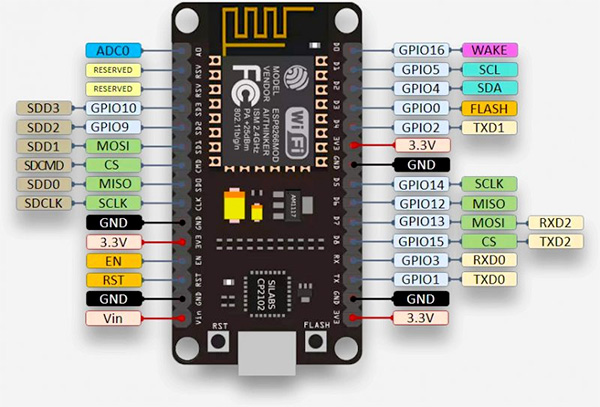

# {{ page.title }}

## Wat is een NodeMCU of ESP8266?

Een ESP8266 (NodeMCU) is een chip, ook wel IC (Integrated Circuit) genoemd.
Het is niet een willekeurige simpele chip. Het is een zogenaamde SoC (System on a Chip), gemaakt door het Chinese bedrijf Espressif.
Deze chip bevat een microcontroller unit (MCU) vergelijkbaar met een microcontroller op een Arduino. Maar dan beter en goedkoper.

*Bron: [https://www.tweaking4all.nl/hardware/esp8266/beginnen-met-esp8266/](https://www.tweaking4all.nl/hardware/esp8266/beginnen-met-esp8266/)*

## Input en Output

Hieronder zie je een schema van de NodeMCU met daarop allerlei input en output pinnen, ook wel GPIO pins genoemd (General Purpose Input/Output pins).

Met deze GPIO pinnen kun je input lezen, bijvoorbeeld de temperatuur, of een knop die wordt ingedrukt of een geluidsmeting.
Je kunt met de GPIO pinnen ook output sturen, en zo een LED aan en uitzetten, een motortje laten draaien en nog veel meer.

Daarnaast heeft de NodeMCU een ingebouwde WIFI-module, zodat je vanaf de NodeMCU verbinding kan 
maken met een WIFI netwerk en de input die le hebt uitgelezen naar een server (of andere NodeMCU) sturen.

In de Arduino IDE schrijf je de code wordt uitgevoerd op de NodeMCU.

- De code maakt bijvoorbeeld eerste een de Wifi verbinding
- Leest daarna elke seconde de temperatuur uit van een temperatuur sensor die is verbonden met een input pin.
- Stuurt deze gegevens naar een webserver
- De webserver slaat ht op in een database
- Een webpagina haalt de gegevens op en maakt er een mooie grafiek van

### Links naar meer hulp en tutorials

Er is veel te vinden over de NodeMCU op internet. Google naar "NodeMCU arduino tutorial" en je vindt veel informatie.

Hier alvast wat sites om je verder op weg te helpen:

- [https://www.electronicwings.com/nodemcu](https://www.electronicwings.com/nodemcu)
- [https://randomnerdtutorials.com/how-to-install-esp8266-board-arduino-ide/](https://randomnerdtutorials.com/how-to-install-esp8266-board-arduino-ide/)
- 
