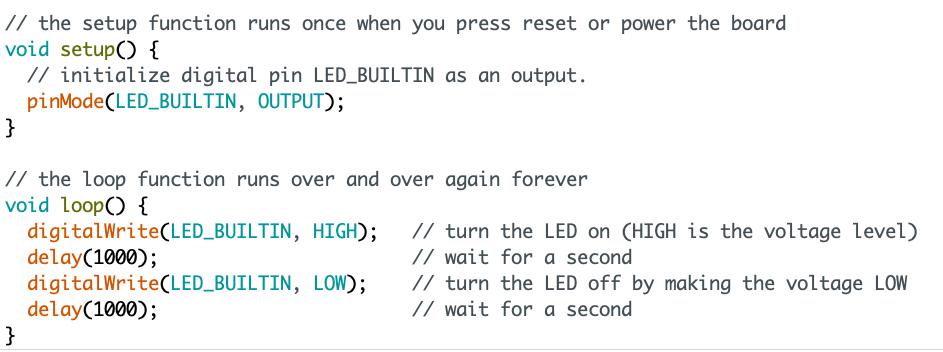
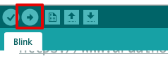
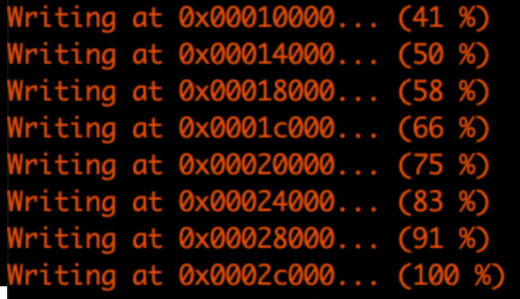
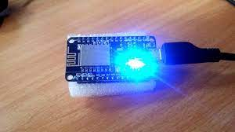

# {{ page.title }}

We gaan nu kijken of de verbinding met de NodeMCU werkt.

- Sluit de lege sketch die standaard opent als je de Arduino IDE start
- Kies in het menu: `Bestand > Voorbeeld > 01. Basics > Blink`
- Je ziet nu de code die de ingebouwde LED laat knipperen

De `setup()` function wordt één keer uitgevoerd als het programma start. Handig om instellingen goed te zetten.

De `loop()` function wordt zo vaak mogelijk uitgevoerd. Hier kun je dus code gaan schrijven die voortdurend iets doet.
Bijvoorbeeld een LED laten knipperen, de temperatuur meten, iets aansturen etc.

### De code (sketch) uploaden

De code kun je uploaden met de upload-knop (pijl naar rechts)

Onderin zie je als het goed is dat de code wordt gecompileerd en wordt geupload naar de NodeMCU.

Krijg je een foutmelding? Lees dan eerst de foutmelding en kijk of je kunt achterhalen wat er fout gaat.
Google op de foutmelding bijvoorbeeld. Vraag anders hulp aan de docent of een studiegenoot.

---

Na het uploaden wordt de NodeMCU herstart en wordt code die is ge-upload uitgevoerd.
Je zou nu een knipperende LED moeten zien op je NodeMCU:

