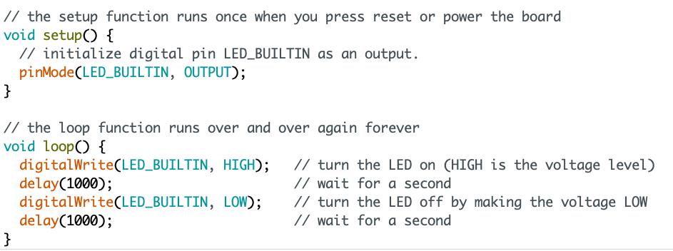
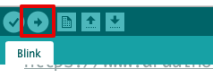
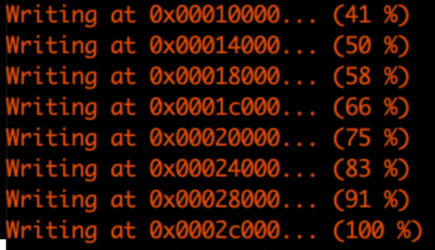
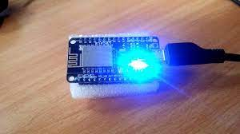

# {{ page.title }}

Je gaat nu testen of de verbinding met de NodeMCU goed werkt en of je jouw code naar de NodeMCU kunt uploaden.

## De Blink sketch openen
{: .text-green-100 .fs-6}

1. Open de Arduino IDE 
2. Sluit de lege sketch die standaard opent als je de Arduino IDE start
3. Kies in het menu: `Bestand > Voorbeeld > 01. Basics > Blink`
4. Er wordt nu een kant en klaren "sketch" geladen.

Deze code laat de ingebouwde LED op je NodeMCU elke seconden knipperen.

---

De `setup()` function wordt altijd één keer uitgevoerd,  als het programma opstart.\
Dit is een goede plek om je code naar de start situatie te zetten, om bepaalde instellingen goed te zetten, of bijvoorbeeld om verbinding te maken met een WIFI netwerk.

De `loop()` function wordt zo vaak mogelijk uitgevoerd. Hier schrijf je code die voortdurend iets doet.\

Bijvoorbeeld:

- een LED laten knipperen
- de temperatuur meten
- een led aan of uitzetten
- gegevens op te sturen naar een server

## De code (sketch) uploaden
{: .text-green-100 .fs-6}

Druk op de upload-knop bovenin (icoon met de pijl naar rechts) om de code naar je NodeMCU te sturen.

Onderin zie je als het goed is dat de code wordt gecompileerd en wordt geupload naar de NodeMCU.

Krijg je een foutmelding? Lees dan eerst de foutmelding en kijk of je kunt achterhalen wat er fout gaat.
Google op de foutmelding bijvoorbeeld. Vraag anders hulp aan de docent of een studiegenoot.

Na het uploaden wordt de NodeMCU opnieuw opgestart en wordt de code die is ge-upload uitgevoerd.

Je zou nu een knipperende LED moeten zien op je NodeMCU:

---

