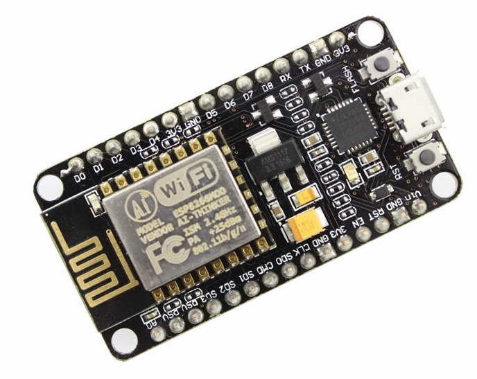
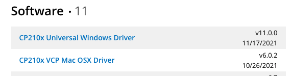

# {{ page.title }}

Voordat je kunt werken met de NodeMCU heb je drivers nodig. Dit is software waarmee je de NodeMCU kunt aansturen via de USB kabel waarmee je hem aan je computer koppelt.

## Installeer de drivers

- Ga naar [https://www.silabs.com/developers/usb-to-uart-bridge-vcp-drivers](https://www.silabs.com/developers/usb-to-uart-bridge-vcp-drivers)
- Klik bovenaan op het tabje DOWNLOADS
- Download en installeer de drivers voor jouw besturingssysteem.

Hier lees je meer over de software die je moet installeren: [https://cityos-air.readme.io/docs/1-usb-drivers-for-nodemcu-v10](https://cityos-air.readme.io/docs/1-usb-drivers-for-nodemcu-v10])

- [Hulp bij installatie op Windows](https://cityos-air.readme.io/docs/windows-os-installation)
- [Hulp bij installatie op Mac](https://cityos-air.readme.io/docs/1-usb-drivers-for-nodemcu-v10)

Heb je een iets oudere NodeMCU, dan kun je [deze drivers](https://github.com/nodemcu/nodemcu-devkit/tree/master/Drivers) gebruiken.

---

## Node MCU instellen

Bekijk de video hier onder en volg de instructies. De stappen en de link die in de video getoond worden vind je onder de video.



- [Download de Arduino IDE](https://www.arduino.cc/en/software) (versie die begint met 1.8) en installeer.
- Start de Arduino IDE op.
- Gebruik deze URL om de NodeMCU boards in te laden in je Arduino IDE: `http://arduino.esp8266.com/stable/package_esp8266com_index.json`
- Installeer de ESP8266 library (zie video)
- Selecteer je board: NodeMCU 1.0
- Sluit je NodeMCU aan via de USB kabel op je computer.

**Krijg je op de Mac een foutmelding? [Kijk dan hier voor een mogelijke oplossing](mac)** 

